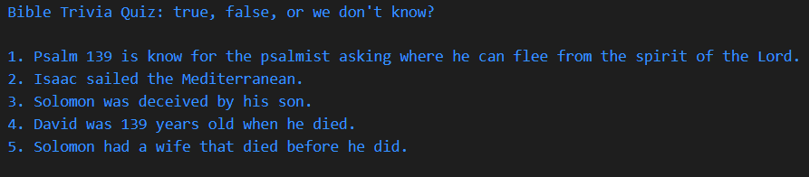

# mixed-messages-codecademy
## Codecademy Porfolio Project: A js program that generates random trivia questions from the Bible

    This program contains two groups of data, with each group containing two data sets. The groups consist of statements involving Bible characters in one set and numbers in the other, but the numbers and names of the Bible characters have been taken out and placed as separate data pieces in a separate data set, the second data set of each group. Five random questions are then selected from either group and paired with data pieces from their individual groups. The new statements are then shuffled and printed to the console.

    The questions involving numbers generally have one right answer. The questions involving names generally can be true for several different characters.